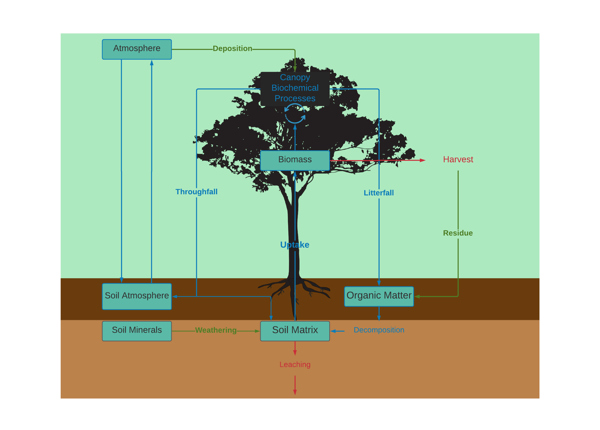
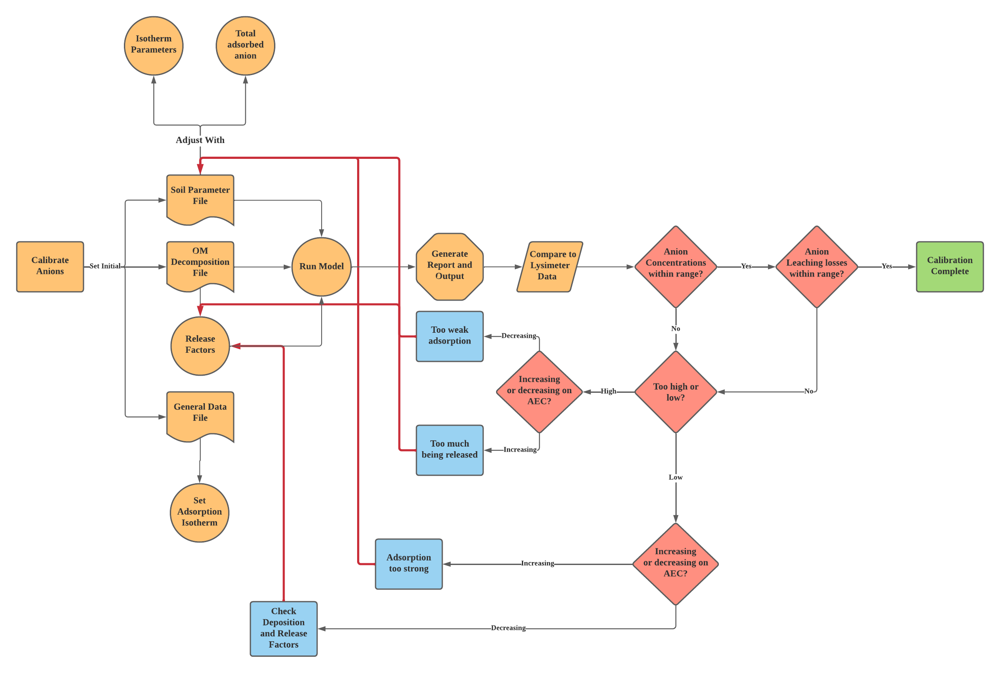
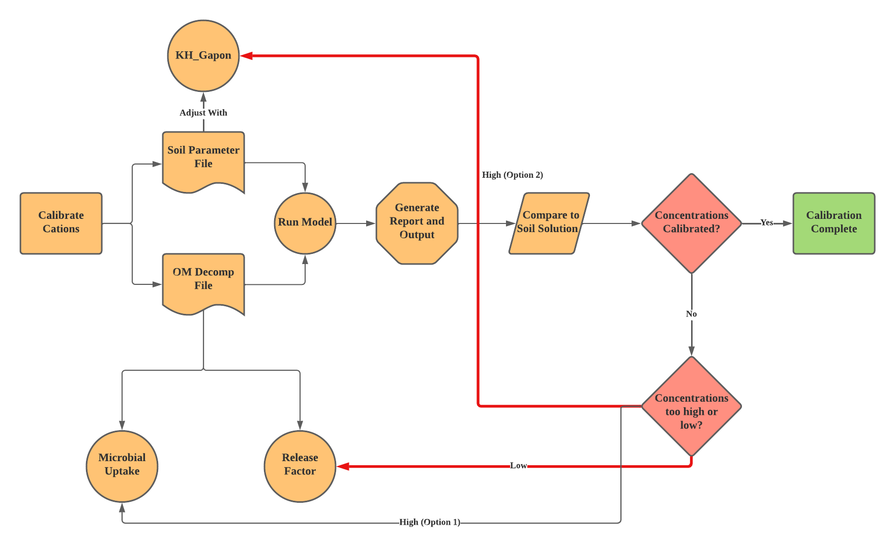

```{r global_options, include=FALSE}
knitr::opts_chunk$set(fig.pos = 'H')
```

```{r, include=FALSE}
library(kableExtra)

```


<!--Title Page Below, possible background theme/image-->

<!--Insert List of Abbreviations-->
\newpage

## Introduction

<!--Meant to be a User guide, maybe a brief history can be mentioned at the end, but the intro should be short and descriptive-->

The Nutrient Cycling in Forested Ecosystems (NutsFor) model is a stand-level biogeochemical 
model which simulates the forest nutrient dynamics of 16 chemical species. It was developed to study a broad range
of forest types at the Breuil-Chenue experimental
site in Burgundy, France [@vanderheijdenNutsForProcessorientedModel2017]. NutsFor is based on aspects of 
the Nutrient Cycling Model (NuCM) [@munsonNuCMCodeVersion1992] and the 
ForSAFE model [@wallmanForSAFEIntegratedProcessoriented2005].
NutsFor integrates several biogeochemical processes, including hydrology, soil exchange chemistry, mineral
weathering, stand growth and uptake, and atmospheric deposition. This manual describes the most 
recent iteration of NutsFor (version 3_04_2021), which further includes stand harvest, biomass residues, 
and the ability to limit plant access to cation nutrients in the liquid and solid phases.

```{r, echo=FALSE, fig.cap="Pool and Flux Diagram for NutsFor. Blue text represents internal cycling proccesses, green input fluxes, and red output fluxes. Blue boxes show nutrient pools."}


```


As NutsFor is an active project of Gregory van der Heijden, model capabilities are open to change based on collaboration, 
changes noted from the original model are noted with an asterisk (“*”).This user manual is intended to give relevant 
information about the model's capabilities, useful tips regarding its usage, insight into the equations and theory which
link model parameters,and information on how to effectively use NutsFor in parallel to R-Studio. Below is a table of
NutsFor's capabilities compared to other contemporaneous and historically used models, to help guide model choices. 

&nbsp;


```{r, echo=FALSE, message=FALSE}
Model_Table<-data.frame(Model_Names=c("NutsFor", "Pnet-BGC", "NuCM","ForSAFE", "CENTURY", "3-PG"),

   
Forest_Management=c("X","X", "", "X", "X", "X"),

BC=c("X", "X", "X", "", "", ""),

Min_Weathering=c("X", "X", "X", "X", "", ""),


N_Cycle=c("X", "X", "X", "X", "", ""),

Soil_Layers=c("X", "", "X", "X", "", ""))

kbl(Model_Table, col.names=c("Model Names", "Forest Management", "Base Cations", "Mineral Weathering", "N Cycle", "Soil Layers"), align="c")%>%
   kable_classic(full_width = F, html_font = "Times")
           
```


&nbsp;

## Model Start Up

Prior to running or implementing change to model parameters, the user should go through the input and output 
files for NutsFor using excel. NutsFor does not currently have a built-in method to visualize results, 
it is recommended that the user use excel macro commands or R to automatically read generated files
(which will always output with the same structure) to visualize results. This is highly important in the
calibration phase of model implementation, and should be done prior to attempting to test model parameters 
for every file and output.

The model is simple to run, simply double-click or other wise enact the NutsFor.exe file. The model 
will run and output results to its corresponding .csv files automatically. If the output files are 
moved from the NutsFor directory or removed, NutsFor will generate new csv files as long as the Output 
folder is still present in the NutsFor.exe directory. A successful model run will be accommodated by a 
“Exporting Model Run Data” and “Model Run End-Press Return to Close”. Unsuccessful model runs (i.e., crashes) 
will result in either the NutsFor.exe closing on its own or on the former messages never appear in the 
NutsFor.exe terminal.

\newpage

## Input Files

There are 11 input files for NutsFor (.nut files). These
files are csv files which can be opened through excel. A full list of the input
parameters, separated by the file they appear in, is shown in the tables below.
Below each table is a more extensive description of each variable and its
effects on model outputs.

&nbsp;

### Deposition Files

&nbsp;

```{r, echo=FALSE, fig.pos="H"}
text_tbl <- data.frame(
Input= c("Ca, Mg, K, Na, NO3, NH4, SO4, Cl, PO4, DOC, H, Al, Si"),
Units=c("$\\mu$mol/L"),
Description = c("Determines the amount of each species deposited into ecosystem by Dry Deposition")
)

kbl(text_tbl, booktabs = T, caption="Dry Deposition and Rainfall Concentration Files", col.names =  c("Input","Units","Description"), escape=FALSE) %>%
kable_styling(full_width = F, latex_options = c("scale_down", "HOLD_position", font_size=12)) 
```


&nbsp;

**Description of Parameters: Deposition Files**

&nbsp;

The dry deposition file is comparable to the Rain Concentration file. It simply delegates the deposition of
chemical species without the deposition of water. The files start with An and Mois (Year and Month Columns), 
and then lists out chemical species from left to right. 

&nbsp;


```{r, echo=FALSE}
#Weather Data File

Weather_Tbl<- data.frame(
   Input= c("Year", "DOY", "RF", "PET", "Tave"),
   Units= c("Year", "Day", "mm", "mm", "Degrees Celsius"),
   Description = c("Designates the year of rainfall event.", "Designates the day of the year rainfall occurs.", "Desginates volume of rainfall.", "Desginates the potential evapotranspiration.", "Designates the average air tempertaure every time step.")
)

kbl(Weather_Tbl, booktabs = T, caption="Weather Data File", col.names =  c("Input","Units","Description"), escape=FALSE) %>%
kable_styling(full_width = F, latex_options =c("scale_down", "HOLD_position", font_size=12)) 


```

&nbsp;

**Description of Parameters: Weather Data File**

The Weather data file contains rainfall (RF), potential evapotranspiration (PET), and average air temperature (Tave)
data on a dailey timestep. This data is used to calculate the wet atmospheric deposition flux, the water input flux, and the actual evapotranspiration (AET), along with several other files. 

\newpage

&nbsp;
 
### Soil Files
&nbsp;

```{r, echo=FALSE}


Parameter<-c("Soil Layer", "Soil Layer", "Depth", "Thickness", "Bulk Density", "Solid Density", "Stoniness", "Root Fraction", "pKGibb", "pkAl precip", "pCO2", "Area", "Wilting Point", "Field Capacity", "Saturation", "CEC", "KH Cation", "Percent Mineral Area", "Uptake Fraction Per Layer (all nutrients)", "Nitrification (ks, knit)", "Microbial Turnover", "Organic Matter Parameters", "Soil Solution Initial (Multiple Species)", "Soil Adsorbed Anions Initial", "CEC Initial", "Organic Uptake Fraction (N, P, S)")

Units<-c("N/A", "N/A", "cm", "cm", "$kg/m^3$", "$kg/m^3$", "Percent", "Fraction", "N/A", "N/A", "Unknown", "$m^2/m^3$", "Percent", "Percent", "Percent", "$c{mol}_c/kg$", "N/A", "Percent", "Fraction (max 1)", "ks: $\\mu$mol/L, knit: Fraction", "Multiple of Microbial Pool", "g Nutrient/kg soil)", "$\\mu$mol/L", "$\\mu$mol/kg", "c${mol}_c$/kg", "Fraction")

Short_Description <-c("Desingates number of layers.", "Assigns layer number to each layer", "Tracks vertical depth of soil layer", "Designates the individual thickness of each soil layer", "N/A", "N/A", "Determines the percent of soil particles greater than 2mm in diameter", "Determines fraction of root distribution in each layer","Gibbsite formation constant","Al precipitation constant (unused in current version)", "Partial Pressure of CO2","Weatherable mineral area","Soil moisture at which stand cannot extract water", "Soil moisture after excessive water is leached", "Soil moisture at which all pore space is filled with water", "Total cation exchange capacity", "Gapon coefficients for each cation", "Porportion of total mineral area that each individually defined mineral occupies" , "Determines fraction of needed nutrient which stand uptakes from each", "Nitrification constants that determines NO3 production", "Determines fraction of SOM which turns over", "Iniital Amount of Nutrient Mineralized in the SOM pool.", "Concentration of all chemical species at beginning of simulation", "Adsorbed Concentration of anions at the beginning of the simulation", "Sorbed Concentration of Cations to the CEC at the beginning of the simulation", "Allows trees to access nutrient directly from SOM.")

text_tbl_2 <- data.frame(
Parameter, Units, Short_Description
)

kbl(text_tbl_2, caption="Soil Parameters File", booktabs = TRUE, col.names= c("Input Parameter", "Units", "Description"), escape=FALSE) %>% kable_styling(full_width = F, latex_options = c("scale_down", "striped", "hold_position"), font_size=12)

```

&nbsp;

**Description of Parameters: Soil Parameters**

<!--Keep concise but informative-->

***Soil Layers:***

NutsFor allows any number of soil layers to be set in the
model. Extra layers are added by typing in the new layer quantity into the
Soil_Layer parameter, and adding the new layer to the Soil Parameter file by
parameterizing the new layer as is done for layers before it. When a new layer
is added, the spacing between the different tables in the soil parameters file
is offset, the tables must be cut and pasted such that a single row of blank
cells lies between the tables, otherwise NutsFor will not be able to read the
tables. The total number of soil layers (Nb_Layers) must also be updated in the
General Data File before running the model.

&nbsp;

***Depth and Thickness:***

The depth of the soil layer represents the vertical distance
of the soil layer from the surface of the soil, it is not used in any
calculations. Soil layer thickness determines how thick each soil layer is, it
is recommended that soil layers are set to less than or equal to 20cm thick. Overly thick
soil layers may be liable to over-leaching of nutrients from the soil layers.

&nbsp;

***Bulk Density, Solid Density, and Stoniness:***

Bulk density is defined as fine earth bulk density
(particles less than 2mm in diameter). Solid density is not part of the
calculations of NutsFor, and can be ignored. Stoniness is the percent of soil
particles greater than 2mm in diameter, this parameter affects soil moisture
and hydrology calculations and is important to calculate.

&nbsp;

***Root Fraction and Uptake Fraction per Layer:***

Keeps trace of the root distribution of the stand between
the soil layers, however it does not determine the uptake of nutrients per
layer. The Uptake Fraction per layer parameter truly determines how the stand
extracts nutrients from the soil layers, allowing for greater flexibility in
determining tree uptake dynamics. Intra-annual uptake dynamics are changed
through the Tree Parameter file.

&nbsp;

***pKGibb, pKAl_Precip, pCO2:***

The pKGibb parameter is the -log of the reaction constant of
gibbsite dissolution to free aluminum, similarly the pKAl_precip is the -log of
the reaction constant of Al and its precipitated forms (i.e., the solubility
product). The range of pKAl_precip (or Ksp of Al(OH)3(s)) should be in the
range of 32-35 depending on the pH of the soil layer, pKGibb ranges from 6-9. These
aluminum parameters are important in determining pore water pH, as Al is the
largest contributor of H+ compared to other acids in the model. pCO2 is the
partial pressure of carbon dioxide in the soil solution, it is a constant
multiple of atmospheric CO2 and is <u>not dynamic with decomposition rates.</u>

&nbsp;

***Mineral Area***

This parameter designates the total weatherable mineral surface area of the soil. It is calculated from the equation:

&nbsp;

<u>General Equation 1:</u>

$$
(8*X.Clay)+(2.2*X.Silt)+(0.3*X.Sand)
$$

Citation: [@sverdrupCalculatingFieldWeathering1993]

Note, that clays dominant in high area clays may be misrepresented by this equation.

A more detailed equation, which takes into consideration different sand and silt size particles;

&nbsp;

<u>General Equation 2:</u>

&nbsp;

$$
(8*X.Clay)+(2.2*X.Silt)+(0.3*X.FineSand)+(0.05*X.CoarseSand)
$$
Citation: [@sverdrupGeochemistryKeyUnderstanding1996]

The mineral area parameter is historically difficult to obtain empirically, clay mineralogy plays a large role in determining this parameter, and is seldom measured to its full capacity. The fraction of soil particles in each size class (X.Clay, X.Silt, and X.Sand) are to be calculated from the <u>whole soil</u> (including coarse fragment count), not just the fine particulate fraction. The above approximations of weatherable mineral area do not include the mineral surface area contributed by amorphous minerals such as Al and Fe sesquioxides. They also tend to "breakdown" when soils are high in clay (>20%) [@hodsonDeterminationMineralSurface1998]. In cases where a soil is high in clay, calculated mineral areas must be calibrated to achieve desired weathering rates. It is likely that the Sverdrup 1993 simple surface area equation will under estimate mineral area in high clay soils than over estimate. 

Since this parameter is difficult to calculate, it will be likely that simulated mineral weathering rates are lower than those observed or calculated for a given stand. In this case the mineral weathering rates must be calibrated by increasing (or decreasing, if weathering is too high) the mineral area parameter. Mineral weathering rates are linked to proton concentrations, lower pH stimulates mineral weathering. Mineral weathering thus consumes protons and can be included in the calibration of pH and alkalinity. 
&nbsp;

**Soil Moisture Parameters**

1). ***Wilting Point***

   The percent soil moisture which corresponds to the wilting point; i.e., the pressure of water in the soil matrix is at -15kPa. Wilting point may have a different reference pressure depending on the texture of the soil.
   
&nbsp;

2). ***Field Capacity***

   The percent soil moisture which corresponds to how much water the soil can hold after drainage of excess water. Typically this measurement is set to the reference pressure of -33kPa. 
   
&nbsp;

3). ***Saturation***

   The percent of soil moisture corresponding to all pore space in soil being filled with water. Effective porosity can be measured to obtain this parameter. 
   
&nbsp;

**CEC Parameters and CEC Initial**

1). ***CEC***

   This parameter is the effective cation exchange capacity (ECEC) of each soil layer. This parameter is usually measured for every soil and soil layer for every depth increment, however there are multiple methods through which this can be accomplished (Citation, General technical manual). In general, ECEC can be calculated as:
   
&nbsp;

<u>Equation 1:</u>

   $$
   ECEC= 2[Ca^{+2}]+ 2[Mg^{+2}]+[K^+]+[Na^+]+3[Al^{+3}]+[NH_{4}^{+}]
   $$

&nbsp;

2). ***Gapon Selectivity Coefficients (KH_Cation)***

   These coefficients determine the propensity of each cation to be replaced on the CEC with H+.  High selectivity coefficients indicate that a cation has a high affinity for the CEC, and are thus liable to stay on the CEC rather than weather off due to the presence of other cations. Low coefficients will likely lead to high CEC weathering of cations, which may result in high soil solution pH. This is due to both the consumption of protons in the soil solution, which kick off low-affinity cations, as well as the increase in acid neutralizing capacity (ANC) that comes with increased base cation concentrations. This is because ANC is calculated as the sum of base cations minus the sum of acid anions. When ANC is near or above 0, soil solution pH will be difficult to constrain. 

Gapon coefficients are to be calculated as:

<u>Equation 2:</u>
   $$
   K_{H:Cation^{+n}}=(\frac{E_{Cation^{+n}}}{[Cation^{+n}]})*(\frac{[H^{+}]}{E_{H}})
   $$
   Where;
   $$
   E_{H}=\frac{[H^{+}]_{adsorbed}}{ECEC}
   $$
   and 
   $$
   E_{Cation^{+n}}=\frac{[Cation^{+n}]_{adsorbed}}{ECEC}
   $$
   Note that 
   $$
   n = Valence
   $$
   
   All concentration units are in mmol/L. It should be noted that these values heavily rely on measured initial cation concentrations, and so they may be manipulated to get a better match between adsorbed and dissolved cations. Note that increasing the selectivity coefficient of one cation will change the relative selectivity of all cations. For instance, increasing Ca selectivity will lead to more Ca adsorption to the CEC, which will in turn kick off other cations, assuming the selectivity of the other cations remains the same. 
   
&nbsp;

3). ***CEC Initial***

   This parameter is not under the "CEC parameters" heading in the Soil Parameter file, rather it is located at the bottom of the Soil Parameter File (it it the last table, named CEC Initial). This parameter determines the total adsorbed supply of cations initially on the cation exchange complex. 

&nbsp;

**AEC Parameters**

   Anion Exchange Capacity (AEC) is implemented in the model for 3 anions; Sulfate, Phosphate, and Chloride. Sulfate adsorption can be modeled using either  a Langmuir or Freundlich adsorption isotherm. Chloride is modeled using the Langmuir model, Phosphate the Freundlich model. Sulfate adsoprtion isotherms can be selected in the General Data File (Input Table 4). 

1). ***Soil Adsorbed Anions Parameters***

Each anion has two AEC adsorption parameters associated with it, Parameter #1 (Langmuir) and Parameter #2 (Freundlich). 
These parameters will stand for different variables depending on the adsorption isotherm selected.

&nbsp;

2). ***Soil Adsorbed Anions Initial***

The initial adsorbed anion pool must be specified in the model. This value is in $\mu mol/kg$. 

&nbsp;

```{r, echo=FALSE, message=FALSE}

#Soil Temperature File

Parameters_T9<-c("Year", "Month", "Layers (1-n)")

Units_T9<-c("Year", "Month", "Degrees Celsius")

Description_T9<-c("Desginates the year corresponding to layer and temperature data.", "Sepecifies the month.","Specifies the average monthly temperature at each time point.")

text_tbl_9 <- data.frame(
Parameters_T9, Units_T9, Description_T9
)

kbl(text_tbl_9, caption="Soil Temperature File", booktabs = TRUE, col.names= c("Input Parameter", "Units", "Description"), escape=FALSE) %>% kable_styling(full_width = F, latex_options = c("scale_down", "striped", "hold_position"), font_size=12)

```

&nbsp;

**Description of Parameters: Soil Temperature File**

The structure of this file is fairly straight forward, for each layer, month, and year of simulation, an average soil temperature is entered. The soil temperature value is used to calculate decomposition and chemical reaction kinetics. Numerous soil-temperature monitoring stations are active around the world [Cite Here.]

&nbsp;   

```{r, echo=FALSE}
Parameter_T3<-c("Litter Concentration (N, Ca, Mg,K, S, P)", "Litter C Pool", "Layer frac (Fine, Coarse, Humus)", "Decomp rate", "CO2FACT", "Nutrient Factor (DOCFACT, N Fact, Ca Fact, Mg Fact, K Fact, S Fact, P Fact", "NULL")

Units_T3<-c("mmol Nutrient/mol C", "$mmol C/m^2$", "N/A", "$mmol/(m^2*mo)$", "N/A", "mmol Nutrient/mol C", "Null")

Description_T3<-c("Determines concentration of nutrient elements in the litter fraction of OM.", "Sets the litter carbon pool, and thus the amount of nutrients per unit area.", "Designates the OM distribution between coarse litter (first column), fine litter (second column), and humus (third column)", "Calibration decomposition factor shows up multiple times in the file for the 3 OM fractions (1-3) and for the mineral soil layers (1-n).", "Calibration factor that determines the proportion of decomposed carbon that effluxes as carbon dioxide.", "Calibration factors for both the 3 OM fractions (1-3) and the mineral soil fractions (1-n). Can be used to calibrate soil solution and liter flow ion fluxes, range from 0 to 1.", "NULL")

text_tbl_3 <- data.frame(
Parameter_T3, Units_T3, Description_T3
)

kbl(text_tbl_3, caption="OM Decomposition File", booktabs=TRUE, col.names= c("Input Parameter", "Units", "Description"), escape=FALSE) %>% kable_styling(full_width = F, latex_options = c("scale_down", "striped", "HOLD_position"), font_size=12)


```

&nbsp;

***Description of Parameters: OM Decomposition***

**Litter Parameters**


The litter nutrient concentration, C pool, and decomposition rate parameters are used to calculate the
litter decomposition of carbon at every time and the nutrient release rate (also known as 
the mineralization rate). Nutrient release also uses the release factor parameter specified by the user.

Litter decomposition follows the equation:

&nbsp;

<u>Equation 3:</u>

$$DecompC(t,n)=k_{n}*Pool_{C}(t,n)*f(T)*10^3$$
Where $DecompC$ is the decomposition rate of C at time step $t$ for litter layer $n$ ($mmol*m^{-2}*month^{-1}$),

$k_{n}$ is the user specified decomposition rate or "Decomp rate" ($mmol C*month^{-1}$),

$Pool_C$ is the carbon pool at time step $t$ for litter layer $n$ ($mol*mol^{-2}$), and 

the temperature limiting factor $f(T)$ is given by:

&nbsp;

<u>Equation 4:</u>

$$f(T)= e^{(\frac{T_{ave}-T_{ref}}m)}$$
Where $T_{ave}$ is the average air temperature from the weather data file,

$T_{ref}$ is the optimal temperature of decomposition, and

$m$ is a function parameter. 


The nutrient release following litter carbon decomposition is driven by the following equation:

&nbsp;

<u>Equation 5:</u>

$$R_{\sigma}=DecompC(t,n)*[\sigma]_{Litter}(t,n)*ReleaseFact(\sigma, n)*10^{-3}$$


Where $R_{\sigma}$ is the flux of nutrient $\sigma$ ($mmol*m^{-2}*mol^{-1}$),

$[\sigma]_{Litter}(t,n)$ is the concentration of nutrient $\sigma$ at time $t$ for litter
layer $n$ ($mmol*m^{-2}*mol^{-1} C$) , and

$ReleaseFact(\sigma, n)$ is the user-specified nutrient release factor for each litter layer $n$. 

The release factor parameter designates the mmol of nutrient $\sigma$ which releases for every mol C, 
setting this value to 1 indicates a stoichiometrically proportional release between C and the nutrient $\sigma$. 
Below one indicates a slower release rate and net retention relative to C. As NutsFor does not simulate 
litter CEC base cation stabilization nor litter-layer organic complexation, the release rates of base cations may
require reduction if litter nutrient buildup is net-negative over a short simulated time frame,
where it should be constant or building. Release rates of all nutrients will depend on the species
of tree, with broadleaf litter tending to lose nutrients faster than coniferous needle 
litter [@dijkstraCalciumMineralizationForest2003; @bockheimNutrientDynamicsDecomposing2011]. 
The species $Fe^{+3}$ and $Al^{+3}$ will tend to increase
in litter as they form organo-metallic complexes with negatively charged sites of decomposed
litter [@rustadElementDynamicsDecay1994]. However, NutsFor does not simulate $Fe^{+3}$ and does
not simulate organic-Al chemical interactions. Since the short-term behaviors of nutrient release and retention
in litter can vary significantly [@rustadElementDynamicsDecay1994], the user should look to broader nutrient
build-up trends over decadal time scales to confirm model outputs. The user should also observe
seasonal trends in litter decomposition and nutrient release fluxes to help confirm model parameters. 

&nbsp;


### General Files
&nbsp;
```{r, echo=FALSE}
Parameter_T4<-c("Start Year", "End Year", "Nb Layers", "Nb Minerals", "Mineral names", "OA pka", "Aluminum", "Phosphoric Acid", "DIC", "Organic acid size", "Nb Tree comp*", "Anion Adsorption isotherms")

Units_T4<-c("Year", "Year", "N/A", "N/A", "N/A", "N/A", "N/A", "N/A","N/A", "Carbon/Charge", "N/A", "N/A")

Description_T4<-c("Determines simulation start year.", "Determines simulation end year.", "Designates number of layers to be read", "Designates the number of minerals", "Lists out the minerals to be simulated", "Designates the pka of organic acid stages of dissolution", "Designates Al pka", "Desingates phosphoric acid pka", "Designates DIC pka", "Determines how many C molecules are present for every negative charge on organic acids.", "Determines the stand's species composition", "Determines adsroption isotherm used for anions (1=langmuir, 2=Freundlich)")

text_tbl_4 <- data.frame(
Parameter_T4, Units_T4, Description_T4
)

kbl(text_tbl_4, caption="General Data File", booktabs = TRUE, col.names= c("Input Parameter", "Units", "Description"), escape=FALSE) %>% kable_styling(full_width = F, latex_options = c("scale_down", "striped", "hold_position"))


```
&nbsp;

**Description of Parameters: General Data File**

***Simulation Length***

Simulation length (the number of years which is simulated) is determined by the Start_Year and End_Year parameters. For example, a starting year of 2015 and an ending year of 2020 is 6 total years of simulation (starting in Jan of 2015 and ending in December of 2020). Note that deposition files and the soil temperature file must be extended by however long the simulation is run for (the program does NOT loop over these files). 

&nbsp;

***Acid pka***
Numerous acids have their pKas (-log of their dissolution constant) set here. These parameters can be taken from online chemical databases, assuming an average room temperature (25 $\circ$C).

&nbsp;

***Organic Acid Size***
This parameters determines the number of carbons for every charged site on an organic acid; it is used to calculate the charge density of organic acids. Note that this is a global parameter, changing this number changes R- concentrations in all layers. Lowering this parameter leads to a higher charge density (and thus more acidic) soil solution, which tends to cause cations from the CEC to dissolve into solution. 

A potential side effect of high cation concentrations due low charge density is suppressed weathering release of cations, as per equation X.X in Equations. 

&nbsp;

```{r, echo=FALSE}

#Mineral Data File

Parameter_T5<-c("Mineral", "pKH", "pKH2O","pKCO2", "pKr","kH", "kH2O", "kCO2", "kr", "nH", "WAlH",	"WBCH",	"WAlH2O",	"WBCH2O", "nCO2",	"nr",	"$CAl*10^-6$",	"$CR*10^-6$",	"$CBC*10^-6$",	"Ca, Mg, K, Na, Al, Si,	PO4", "Ca.Iso, Mg.Iso, K.Iso	Na.Iso, Al.Iso, Si.Iso, PO4.Iso")

Units_T5<-c("N/A",  "N/A", "N/A","N/A", "N/A","N/A", "N/A", "N/A", "N/A", "N/A", "N/A",	"N/A",	"N/A",	"N/A", "N/A",	"N/A",	"$[Al]*10^-6$",	"$[R]*10^-6$",	"$[BC]*10^-6$",	"Stoichiometric", "N/A" )

Description_T5<-c("Name of mineral.", "Reaction constant of mineral with H+", "Reaction constant of mineral with water.","Reaction constant of mineral with $C{O}_2$", "Reaction constant of mineral with organic acid (R)","Temperature dependence of mineral-H+ reaction.", "Temperature dependence of mineral water reaction.", "Temperature dependence of mineral $C{O}_2$ Reaction", "Temperature dependence of mineral Organic Acid reaction.", "Mineral dissolution H+ reaction order.", "Brake reaction order for Al (${f}_H+$)",	"Brake reaction order for BC (${f}_{H+}$)",	"Brake reaction order for Al (${f}_{H2O}$)",	"Brake reaction order for BC (${f}_{H2O}$)", "Brake reaction order for $C{O}_2$ (${f}_{C{O}_2}$)",	"Brake reaction order for R $({f}_R$)",	"Limiting Al concentration",	"Limiting BC concentration",	"Limiting R- concentration",	"Sets the stoichiometry of each mineral.", "Unknown")


text_tbl_5 <- data.frame(
Parameter_T5, Units_T5, Description_T5
)

kbl(text_tbl_5, caption="Mineral Data File", booktabs = TRUE, col.names= c("Input Parameter", "Units", "Description"), escape=FALSE) %>% kable_styling(full_width = F, latex_options = c("scale_down", "striped", "hold_position"))


```

&nbsp;

**Description of Parameters: Mineral Data File**

The NutsFor weathering sub-module is derived from the PROFILE mineral
weathering model [@sverdrupCalculatingFieldWeathering1993]. PROFILE is based on transition state theory, 
which dictates how the mineral weathering reaction equations are formulated. The mineral parameters in the Mineral data file were emprically derived from research in Swedish and European soils, assuming congruent weathering of mineral components [@]. PROFILE uses five weathering reactions:

1). $H^+$ and  Al ,
2) $H_{2}O$ and Al,
3). OH- and Al,
4). $CO_{2}$,
5). Organic acids

Citation: [@hodsonCriticalEvaluationUse1997]. 

Note that the mineral data file of NutsFor does not contain the OH- reaction parameters. 

In general, NutsFor mineral weathering will be controlled by weatherable mineral area, soil moisture, and the release of weathering agents $H^+$, $R^-$, and $H_{2}O$. This section introduces how the parameters contained in the Mineral data file of NutsFor are used to calculate mineral weathering rates. 


***Dissolution Reaction Parameters***
The parameters which determine mineral dissolution dynamics are the equilibrium constants (pK values), the thermal dependencies (k values) and the reaction orders (n values). These are then combined in the following equation:

&nbsp;

<u>Equation 6:</u>

$$r_j=(\frac{k_{H^+}*{[H^+ ]}^{n_{H^{+}}}}{f_{H^+}}) +(\frac{k_{H_{2}O}}{f_{H_{2}O}}) +(\frac{k_{CO_2}*P_{CO_2}^{n_{CO_2}}}{f_{CO_2}}) +(\frac{k_R*[R^- ]^{n_{R^-}}}{f_{R^-}})$$


where $r_j$ is the Weathering Rate of mineral $j$, 

$k_{species}$ is the rate coefficient of each species for each mineral,

and $n_{species}$ is the reaction order (or weathering dependence) of each species. 


The reaction rate coefficient $k_{species}$ of a specific reaction is calculated by the equation:

&nbsp;

<u>Equation 7:</u> 

$k=10^{-(pK+(E_{A}/R*ln(10))*(1/T)-8.56*10^{-3})}$

Where $pK$ is the rate coefficient of the reaction at the temperature T=280°K, expressed as $-log_{10}(K)$,

$E_{A}$ is the Arrhenius activation energy ($J*kmol^{-1}$), 

$R$ is the universal gas constant ($J*kmol^{-1}*K^{-1}$), and

$T$ is the absolute temperature ($°K$). 


The equation calculates the summation of all chemical species (H+, H2O, CO2, and Organic Acid) has on mineral weathering rate $r_j$. Each calculation also has a restricting coefficient ($f_{species}$), which is a product inhibition coefficient discussed in the next section. 


&nbsp;
***Inhibition Reaction Parameters***
The inhibition coefficients are calculated dynamically based on the concentration of cations in soil solution layers. The higher the solution concentration of base cations, the lower favorability of the weathering reaction due to the generation of less active surface complexes over the course of weathering [@]. The equation which calculates the product inhibition factor $f_{species}$ for each weathering agent is:

&nbsp;

<u>Equation 8:</u>
$$f_{H+}= (1+\frac{[Al]}{C_{Al}})^W_{Al_{H}}*(1+\frac{[BC^{+2}]}{C_{BC}})^W_{BC_{H}}$$

<u>Equation 9:</u>


$$f_{H_{2}O}= (1+\frac{[Al]}{C_{Al}})^W_{Al_{H_{2}O}}*(1+\frac{[BC^{+2}]}{C_{BC}})^W_{BC_{H_{2}O}}$$


<u>Equation 10:</u>

$$f_{CO_{2}}=(1+\frac{[BC^{+2}]}{C_{BC}})^W_{BC_{H}}$$

<u>Equation 11:</u>


$$f_{R-}=(1+\frac{[R-]}{C_{R}})^W_{R}*(1+\frac{[BC^{+2}]}{C_{BC}})^W_{BC_{H_{2}O}}$$

Where the $C_{Al}$, $C_{BC}$, and $C_{R}$ are saturation concentration parameters,

and the $W_{BC_{H}}$, $W_{BC_{H_{2}O}}$, and $W_{Al_{H}}$ are reaction orders.


These equations mean that as the base cation concentration of the soil solution increases, the weathering rate will become increasingly limited. The magnitude at which this occurs depends on the identity of the mineral and its defined parameters. An instance where this may become relevant is during calibration of free aluminum concentrations. Free aluminum will react with water in the model to release protons, which generally leads to enhanced mineral weathering. However, if free aluminum concentrations are very high, the model will simulate a reduction in mineral weathering, cutting off the positive feedback between aluminum hydrolytic proton release and mineral weathering enhancement. 

Note that the saturation constant (also known as the saturation concentration) sets the maximum solution concentration of each cation in water. The closer the simulated solution concentration is to the saturation constant, the higher the inhibition coefficient becomes and thus the slower the weathering.

New minerals can be added to the NutsFor mineral data file, a more extensive list of minerals is given in [@sverdrupReviewsSynthesesWeathering2019a]. However, the PROFILE model has recently been updated, and now contains saturation concentration and inhibition coefficients for silica and hydroxide. These updates are not currently in the NutsFor model. 


**Weathering Flux**

With the calculation of the mineral weathering rate $r_j$ for each mineral $j$ over the simulated timestep,
the total weathering flux $W_M$ can be calculated as

</u>Equation 12:</u>

$$W_M=\sum_{j=1}^{mineral}(\frac{r_{j}*A_{W}*X_{j}*\Theta*z}{Norm})$$
Where $r_j$ is the specific mineral weathering rate,

$A_W$ is the user-specified exposed mineral area surfaces ($m^{-2}/m^{-3}$),

$X_j$ is the user-specified fraction exposed mineral area which mineral $j$ occupies, 

$\Theta$ is the soil moisture saturation,

$z$ is the soil layer thickness (m),

and $Norm$ is the number of base cation charges released per mol of weathered mineral $j$ ($mol_{c}*mol^{-1}$).


Soil moisture saturation $\Theta$ is calculated by

<u>Equation 13:</u>

$$\Theta=\frac{(\theta*\rho_{solid})}{(\rho_{solid}-\rho_{soil}+\theta*\rho_{water})}$$

Where $\theta$ is the soil volumetric water content ($m^{3}*m^{-3}$),

$\rho_{solid}$ is the solid density of soil ($kg*m^{-3}$), 

$\rho_{soil}$ is the bulk density of soil ($kg*m^{-3}$), and

$\rho_{water}$ is the density of water ($kg*m^{-3}$). 


### Tree and Stand Files

```{r, echo=FALSE}
#Tree Parameter File: Current conversion issue somewhere here!
Parameter_T6<-c("Foliage.start", "Foliage.End","PET.winter.factor","PET.summer.factor","interception" ,"AET.Reduc","Leaching.alpha","Absorption.alpha","Foliar.target.conc","Percent.variation, foliar","Translocation.Percent","Foliar.Exudation","Foliar.Leaching","Foliar.absorption","Wood.target.conc","Wood.initial.conc","Percent.variation, Wood","Bark.target.conc","Bark.initial.conc","Percent.variation, Bark","Branch.target.conc","Branch.initial.conc","Percent.variation, Branch")

Units_T6<-c("$g/m^2$", "$g/m^2$","Multiple","Multiple","cm" ,"Multiple","N/A","N/A","$\\mu$mol/g","Fraction","Fraction","N/A","N/A","N/A","$\\mu$mol/g","Percent.variation","$\\mu$mol/g","$\\mu$mol/g","Percent.variation","","$\\mu$mol/g","$\\mu$mol/g","Fraction")

Description_T6<-c("Starting biomass of foliage.", "Biomass of foliage at the end of simulation.","Multiplies by winter PET values to enhance or reduce PET.","Multiplies by summer PET values to enhance or reduce PET","Sets the volume of water which canopy can maximally intercept." ,"Multiplies by calculated AET to reduce or enhance AET.","Reaction order for foliar leaching reaction.","Reaction order for foliar adsoprtion reaction.","Determines foliar concentration of nutrients.","Fraction of target concentration which foliage can reach before limitation.","Fraction of foliar nutrients that are translocated to stem during litterfall events.","NULL","NULL","NULL","Wood.target.conc","Wood.initial.conc","Percent.variation, Wood","Bark.target.conc","Bark.initial.conc","Percent.variation, Bark","Branch.target.conc","Branch.initial.conc","Percent.variation, Branch")


text_tbl_6 <- data.frame(
Parameter_T6, Units_T6, Description_T6)

kbl(text_tbl_6, caption="Tree Parameters File", booktabs = TRUE, col.names= c("Input Parameter", "Units", "Description"), escape=FALSE) %>% kable_styling(full_width = F, latex_options = c("scale_down", "striped", "HOLD_position"))


```

**Description of Parameters: Tree Parameter File**

&nbsp;

***Tree Nutrient Content***

The biomass of the tree is spilt into 4 compartments, the non-bark bole (heart-wood and sapwood), the bark, the foliage, and the branches. Each compartment has target nutrient concentration ($\mu$mol/g) for  each major nutrient.There is a percent variation parameter for each nutrient for each biomass compartment, this parameter allows the user to model the threshold of tree nutrient uptake before growth limitation is initiated. For instance, a percent variation of .8 for foliar N would mean that the stand would be able to grow at its full potential with 80% or more of its N demand being met by uptake. 

Initial nutrient concentrations can be set separately from target nutrient concentrations, this allows for the simulation of nutrient deficient or stands with luxurious nutrient uptake at the beginning of the simulation. 

&nbsp;

***Foliar Exchange Reactions*** 

The tree parameter file holds several parameters which will drive foliar leaching, adsorption, exudation, and nutrient translocation processes over the course of the simulated stand.

&nbsp;

1). ***Foliar Leaching***

Foliar leaching parameters describe the intensity at which nutrient leaching occurs from the foliage.
Leaching is known to be a significant determinant of base cation cycling in forests and other plant
communities, but is particularly important for K cycling
[@tukeyLeachingSubstancesPlants1970; @sollinsInternalElementCycles1980; @johnsonNutrientCyclingForestsa]. 
It is important to include this process even if little is known about throughfall chemistry
at the site of interest. The magnitude of leaching is known to depend on the pH of the 
throughfall solution, the concentration of elements in the foliage, and the volume of rainfall
which is intercepted by the canopy.  

Foliar leaching follows the equation:

&nbsp;

<u>Equation 14:</u> 

$$FolLeach(t, \sigma)=L_{\sigma}*[\sigma]_{Leaf}(t)*DW_{Leaf}(t)*[H^{+}]^{\alpha}$$
Where the $L_{\sigma}$ is the specific leaching rate coefficient of ionic nutrient $\sigma$ ($month^-1$), and

$[\sigma]_{Leaf}(t)$ is the concentration of ionic nutrient $\sigma$ at time $(t)$ in the foliage ($\mu mol*g^-1$), and

$[H^+]^{\alpha}$ is the hydrogen concentration of throughfall to the power of leaching rate dependence $\alpha$ ($\mu$mol/L, unitless). 

&nbsp;

2). ***Foliar Adsorption***

Foliar adsorption is the proccess through which throughfall nutrients are absorbed into the leaf, acting as a kind of foliar nutrient uptake. 

&nbsp;

<u>Equation 15:</u> 

$$FolAbs(t, \sigma)=A_{\sigma}*[\sigma]_{TF}(t)*TF(t)*([\sigma]_{TF}(t))^\beta$$

Where foliar adsorption for nutrient $\sigma$ at time $(t)$ ($FolAbs(t, \sigma)$) ($\mu mol*m^-2*month^-1$), 

$A_{\sigma}$ is the specific adsorption constant ($month^-1$), 

$[\sigma]_{TF}(t)$ is the throughfall concentration of nutrients at time $(t)$ ($\mu mol*L^-1$),

$TF(t)$ is the throughfall flux at time $(t)$ (mm or $L*m^-2$), and

$beta$ is the rate dependence of adsorption (unitless). 

&nbsp;

3). ***Foliar Exudation***

Some nutrients are exuded from leaf surfaces over time, and can picked up by intercepted water to be
deposited onto the soil. 

&nbsp;

<u>Equation 16: </u>

$$FolEx(t,\sigma)=\gamma_{\sigma}*[\sigma]_{Leaf}(t)*DW_{Leaf}(t)$$

Where foliar exudation ($FolEx(t,\sigma)$)) at time step $(t)$ for nutrient $\sigma$,

{$\gamma_\sigma$} is the effective leaf turnover rate of ionic species $\sigma$ ($month^-1$), 

$[\sigma]_{Leaf}(t)$ is the concentration of ionic nutrient $\sigma$ in the foliage ($\mu mol*m^-2$), and

$DW_{Leaf}(t)$ is the dry weight of the leaf at time step $(t)$ ($g*m^-2$). 

&nbsp;

4). ***Translocation (redistribution)***

Translocation allows for the model to store a fraction of the stand's nutrients during litterfall events. This can reduce the uptake demand of the foliar biomass compartment. The equation which calculates translocation in NutsFor is as follows:

&nbsp;

<u>Equation 17:</u> 

$$T_{\sigma}(t)=[\sigma]_{Leaf}(t)*DW_{Litterfall}(t)*TransFact(\sigma)$$
Where $T_{\sigma}(t)$ is the translocation of nutrient $\sigma$ at time $(t)$, 

$[\sigma]_{Leaf}(t)$ is the concentration of nutrient $\sigma$ in the foliage at time $(t)$,

$DW_{Litterfall}(t)$ is the dry weight of litterfall at time $(t)$, and

$TransFact(\sigma)$ is the user-specified fraction of foliar nutrient translocated during each litterfall event. 

&nbsp;

***Hydrology Parameters***
The PET winter and PET summer factors are calibration factors which can be used to modify PET parameters in the Weather Data file. They range from 0 to 1 and serve as constant multiples over the summer and winter PET entries. The user should take into account that the summer and winter defined in the model are those of the Northern, rather than Southern, hemisphere. 

&nbsp;

```{r, echo=FALSE, message=FALSE}
#Stand Harvesting File
Parameter_T7<-c("Year", "Month",	"Stand.Frac", "Wood.Exp.frac", "Bark.Exp.frac", "Branch.Exp.frac", "Foliage.Exp.frac")

Units_T7<-c("Year", "Month", "Fraction", "Fraction", "Fraction", "Fraction", "Fraction")

Description_T7<-c("Designates the year of harvest event.", "Designates the month of harvest event.", "Multiplies by stand biomass, determines what proportion of stand is removed.", "Determines fraction of wood (bole) removed.", "Determines fraction of bark removed", "Determines fraction of branch removed.", "Determines the fraction of foliage removed.")


text_tbl_7 <- data.frame(
Parameter_T7, Units_T7, Description_T7)

kbl(text_tbl_7, caption="Stand Harvesting File", booktabs = TRUE, col.names= c("Input Parameter", "Units", "Description"), escape=FALSE) %>% kable_styling(full_width = F, latex_options = c("scale_down", "striped", "HOLD_position"))


```
***Description of Parameters: Stand Harvesting File***

The Stand Harvesting file is used to dictate when and what intensity of harvest events over the course of a stand. The Year and Month sections designates which year and month a harvest event is to occur. The stand fraction parameter tells to model what fraction of the total stand is harvested (ranges from 0 to 1). If the stand fraction parameter is set below 1, this indicates a partial harvest or a thinning event. The compartment biomass export fractions dictate what fraction of the harvested stand is taken off site, these parameters can be used to test a range of residue removal conditions on the stand. 

Biomass removal is calculated following the equation:

&nbsp;

<u>Equation 18:</u> 

$$HarvestedFraction=Stand.Frac*Export.Frac$$


```{r, echo=FALSE, message=FALSE}
#Tree growth file

Parameter_T8<-c("Wood: Biomass.Start and Increment ", "Bark: Biomass.Start and Increment", "Branch: Biomass.Start and Increment", "Fol.DW.min: Increment", "Fol.DW.max: Increment")

Units_T8<-c("$g/m^2$","$g/m^2$", "$g/m^2$", "$g/m^2$", "$g/m^2$")

Description_T8<-c("Designates the starting bole biomass at start of simulation and yearly growth increment.", "Designates the starting bark biomass at start of simulation and yearly growth increment.", "Designates the starting branch biomass at start of simulation and yearly growth increment.", "Designates the minimum foliar biomass every year.", "Designates the meximum foliar biomass at every time step.") 


text_tbl_8 <- data.frame(
Parameter_T8, Units_T8, Description_T8)

kbl(text_tbl_8, caption="Tree Growth File", booktabs = TRUE, col.names= c("Input Parameter", "Units", "Description"), escape=FALSE) %>% kable_styling(full_width = F, latex_options = c("scale_down", "striped", "HOLD_position"))

```

&nbsp;

***Description of Parameters: Tree Growth File***

The tree growth file contains a growth increment ($g*m^-2*yr^-1$) column for every biomass compartment except for foliage. Foliage instead has a maximum biomass and a minimum biomass column, which allows the user to set the maximum possible foliar biomass and the minimum foliar biomass, such as that achieved in spring and winter. The user should set these parameters using data on tree growth specific to their stand or ecosystem of interest. If relevant, the user can specify the number of trees which compose the stand (in the tree parameters file), however the growth increment of the total stand per year should be a lumped average growth increment of all the trees within the stand.

Note that the initial and ending biomass of the foliage is set in the tree parameters file and not in the tree growth file. 

The user must include growth increment data post-harvest manually. Say, for instance, that a harvest event is to occur in the year 2025, reducing the tree biomass of the stand to 0 kg/ha. The user must have a growth rate entered for 2026 and beyond which aligns with the growth rate of a newly planted stand. The user may also choose to simulate "empty" or 0 growth years incident with gap years between harvest and replanting phases of site usage. 

When simulating stands, the user should take extra care to include growth and nutrient cycling processes
uniquely present in every kind of ecosystem. For instance, as forests reach old growth stages, 
mortality tends to increase, and biomass stabilizes
for some tree species [@debellOldGrowthDouglasFirWestern1987; @bibleLONGTERMPATTERNSDOUGLASFIR2001]. Highly productive
forests may have high tree mortality, contributing significantly to nutrient turnover and 
thus productivity [@malhiPatternProcessAmazon2004]. The user can attempt to simulate the nutrient inputs from mortality
by utilizing the stand harvesting file, removing and leaving behind some portion of the stand biomass that matches with known mortality inputs. 

&nbsp;

## Output Files

There are 60 output files that NutsFor.exe generates, separated into 9 folders. All files are structured in a readable manner, with units *most* designated. All output files are .csv files separated by ";", all can be read using R. Unlike for input parameter files, output files are largely self-explanatory, however some units are not noted, and some file structures are difficult to immediately read into programs such as R. This section will briefly describe file structures and folder contents, without the extensive descriptions offered for input files. It will also offer basic R studio-based approaches to reading and organizing the data for further analysis. 

&nbsp;

**Output Folders**

&nbsp;

***AEC***

The first folder in the Output data directory is the AEC folder. AEC contains anion adsorption data (SO4, PO4, Cl) for each layer, and so the number of .csv files contained in this folder depends on the user-specified number of soil layers. Each file has a year and month column, and AEC data in units of $\\mu$mol/kg and kg/ha. 

&nbsp;

***Biomass***

The biomass folder contains the "Plant pool" and "Tree data" files. Plant pool contains (I don't know). The Tree data file contains compartment nutrient content and biomass data for the stand. Nutrient contents are given in units of $\\mu$mol/g and kg/ha. Biomass or "dry weight" is given in kg/ha. 

&nbsp;

***Budgets***

The Budgets folder reports the "Above ground fluxes" and "Biological cycle" files. These files contain simplified yearly summary data on nutrient inputs and outputs, and can be used to calculate ecosystem nutrient budgets. The Above ground fluxes files contains deposition fluxes, throughfall flux, net foliar exchanges, litterflow flux, leaching flux, and weathering flux of each nutrient every annual time point. The Biological cycle file contains uptake, litterfall, and organic matter mineralization fluxes. All fluxes are in units of kg/ha/yr. NO3, NH4, SO4, and PO4 are in units of N, S and P (NH4-N, NO3-N, SO4-S, and PO4-P). 

&nbsp;

***CEC***

The CEC folder is identical to the AEC folder in basic structure, it holds a csv file for every soil layer specified. Each file contains cation adsorption data in both $\mu$mol/kg and kg/ha. 

&nbsp;

***Hydrology***

The hydrology folder has two datafiles, the "Hydrology Daily Output" and the "Hydrology Monthly Output" files. 
The monthly output file is smaller and more practical for use, although they contain the same data distributed 
over different time steps. The file begins by reporting the Year and month of each measurement, then reports 
the rainfall (RF), potential evapotranspiration (PET), the actual evapotranspiration (AET), the throughfall. 

&nbsp;

***Litter***

The litter output folder the Litter pool and decomp file, the Litter_kg_ha file, and the litterfall file. 

The litter pool and decomp file holds nutrient data specific to the O-horizon layers. It contains nutrient pool data on the harvest residue litter pool, the coarse litter pool (L1), the fine litter pool (L2), and the humic or very fine litter pool (L3). The file gives data for each pool separately and combined for faster analysis. For each layer, decomp% outputs are given. These values show what percent of O-horizon nutrients has decomposed. The nutrient pool is represented in units of $mmol*m^-2$. 

The next file in the directory is the Litter_kg_ha file. This data file contains the same litter nutrient pool data as the Litter pool and decomp file, but in a more recognizable kg/ha unit. 

The final output file in the Litter directory is the litterfall file. This file contains information on litterfall distribution throughout the time frame simulated. Litterfall dry weight ($g*m^-2$) and nutrient concentrations ($\mu mol*g^-1$ and $\mu mol*m^-2$) are given in this file. 

&nbsp;

***Soil Solution***

The soil solution output folder will contain a throughfall concentration file, a Litterflow concentration file, 
and both a soil solution and leaching layer concentration file for each soil layer specified. All files 
display concentration in units of ($\mu mol*L^{-1}$), except for the leaching layer files, which gives leaching
fluxes in units of ($kg*ha^{-1}$). All data is output on a monthly time step. 

&nbsp;

***SOM***

The SOM output folder contains a SOM data file for each soil layer specified. The file reports nutrient content 
in the SOM mineral pool in terms of total storage of nutrient every month ($mol*m^{-1}$) and the gain of
nutrients every month ($mmol*m^{-2}*month^{-1}$). This file should be used to calibrate SOM outputs in the model. 


&nbsp;


***Weathering***

The weathering output folder reports the weathering of every layer for every chemical species defined in 
the mineral pool. The "Weathering Annual" file contains average annual weathering data over the total
length of the simulation, whereas the layer-specific weathering files contain weathering data on a monthly
time step. Both files report in units of $kg*ha^{-1}$. 

&nbsp;


***Using R with NutsFor***
&nbsp; 

The described output files tend to be long, containing years of simulated data among several files. As mentioned previously, the user should come up with some system to read the NutsFor csv files and visualize the outputs along some time scale. 

For layer-based output folders, such as AEC, CEC, weathering, and soil solution, it is most efficient to read all files from a single output directory into one R dataframe, and use an indexing function to define the individual layers. For instance, a code for reading CEC might look like: 

```{r, eval=FALSE, echo=TRUE}

#Requires this package for code to make sense (pipe operators)
library(dplyr)

#Generates a pattern within "files", locates folder
files <- list.files(path = "~/YourFilePath/Output data/CEC", pattern = "CEC", full.names = TRUE)

#Uses the defined "files", applies the read.csv2 function
#and generates an "id" column unique to each file.
CEC_All<- sapply(files, read.csv2, simplify=FALSE, header=FALSE) %>% 
  bind_rows(.id = "id")

#Designates an index value (1-n) that corresponds to each "id" value, named "group_id" 
CEC_All$group_id <- CEC_All %>% 
  group_by(id)%>%
  group_indices(id)

```

The above code essentially applies an identifying number for each soil layer in a large, aggregated dataset of all the soil layers, which makes it easier to apply graphing functions to the data as well as keep track of data in a single file. Graphing becomes particularly easy, for example the above CEC_All file generated above can be graphed using: 

```{r, eval=FALSE,echo=TRUE}

#Loads the ggplot2 package
library(ggplot2)

#Defines a graph for Ca, defines lines by group_id
CEC_Graph_Ca<-ggplot(CEC_All, aes(x=Date, y=Ca, group=group_id))

#Plots graph
CEC_Graph_Ca

```

&nbsp;

It is likely that dataframes read into R will be in character format rather than numeric. This is because many of the NutsFor output files have 2 rows of character-containing values. Often, this leads to R not being able to read a descriptive header or graph the data correctly. Even if the character values are removed, the data will still be in character format and will not behave as a number in graphical or numerical analysis. To fix this, a simple code can be used:

```{r, eval=FALSE, echo=TRUE}

#Specifies that only columns 2-16 are to be made numeric
CEC_All[c(2:16)]<-lapply(CEC_All[c(2:16)], as.numeric)

```


While R studio is a powerful for analyzing large datasets, it can also be used to generate manuscript-quality tables [Citation] and write dynamic reports or manuscripts [Citation]. Creating such reports can make the following stage of NutsFor usage, calibration, much easier. 

The work flow of a potential R-studio based system can be found below. 

A working example of an R-studio based system using this workflow 
can be found at https://github.com/Coffee-Powered-Scientist/NutsFor_OR2. 

## Calibration
&nbsp;

After starting parameters have been measured for the site or approximated from the literature, and once a reliable method of monitoring NutsFor outputs is constructed, the calibration phase can begin. Calibration entails changing initial parameters within some acceptable range until model outputs match observed measurements. What determines the acceptable range of parameter variation depends on what is known about the site, as well as what is known about the standard error of the parameter itself. 

I recommend planning out the process of calibration using workflows. By identifying which parameters are most likely to vary (and thus can be used to calibrate), a calibration workflow can be generated for every sub-module within the greater NutsFor module. The order which each sub-module is calibrated is very important, the sub-modules with the highest level of control over the outputs of the model should be calibrated first, those that are more precise and downstream of multi sub-modules last. Generally, the order I recommend is the same as described in [@munsonNuCMCodeVersion1992], listed below. However, some processes can be calibrated before others, depending on their relative importance in determining model outputs on a site specific basis. 

I also recommend using no more than 2 parameters to calibrate every 1 observed output. This is because the use of 3 or more parameters to calibrate a single output has an infinite amount of ways which the parameters can be ordered or chosen [@sverdrupGeochemistryKeyUnderstanding1996]. Thus, it is important to choose which parameters are allowed to vary for the site in question, and use *only* these parameters for calibration. 

&nbsp;

1). **Hydrology**

&nbsp;

The calibration of the hydrological sub-module of NutsFor should always occur first, hydrology will affect seasonal decomposition patterns, soil solution concentrations, leaching fluxes, and weathering fluxes. It therefore has control over all other model outputs. The NutsFor hydrology sub-module is an integration of the WATFor hydrological model, developed for the same site (Breuil, France) as NutsFor [@legoutTreeSpeciesEffects2016]. 

To calibrate this system, the user should have some evaporation data for the region to confirm model output. Once the seasonality and magnitude of evaporation (in the model, the Actual Evapotranspiration output or AET) are confirmed against regional data, the hydrology calibration is complete. The user may also view soil moisture parameters over time, these values should be confirmed with collected data or known seasonal patterns. For instance, a soil with a drought season should have soil moisture parameters drop to near wilting point during such events. 

Hydrological outputs are calculated from parameters entered in the Weather Data file, the Soil parameters file, and the Tree data file. The Weather Data file contains information on daily potential evapotranspiration and average air temperature, using the (which equation?) to calculate AET. The soil parameter file will contain soil moisture parameters specific to the site, these parameters will generally be held constant and shouldn't be used to calibrate hydrology. 

To calibrate hydrology AET outputs, the user should either adjust the PET entered in the Weather Data file manually, or use the AET and PET factors in the Tree parameters file to generally calibrate winter and summer PET values. These parameters multiply by the Weather Data file PET or the calculated AET, a value of 1 indicates that the PET and AET is to be the same as entered and calculated, and so forth. 

I found that spring time PET was often over estimated by the reference crop PET calculator that I used, so during my calibrations I chose to manually change PET values for each site I used. If possible, it is always more efficient to directly measured PET and AET for a specific site. 

```{r, echo=FALSE, fig.cap="Hydrological Calibration Workflow. Hydrology can be calibrated using PET and AET factor adjustment parameters located in the tree parameters file. The weather data file can also be edited for more precise adjustment."}
knitr::include_graphics("Images/Hydrological_Workflow.png")

```

&nbsp;

2). **Throughfall & Deposition**

&nbsp;

Calibration of these inputs is rather simple, the user must observe whether or not depositional fluxes of key nutrient cations are correct given the inputs from the Rainfall concentrations, Tree parameters file, and Dry deposition file. The rainfall concentrations file will combine with the Weather data file to determine wet deposition flux, the dry deposition will determine nutrient flux from dry deposition, and the Tree parameters file have various parameters (described above) which dictate foliar leaching and adsorption parameters. All of these files will ultimately be used calculate net deposition of nutrients in the soil at every time step. 

Generally, throughfall fluxes of K+ are significant, a source of data or direct measurement of throughfall should be used to calibrate K+ leaching fluxes as this process is important in determining K+ distribution in soil. Other nutrients, such as Ca and Mg, may experience little leaching or adsorption depending on the forest of interest [@]. 

Once throughfall concentrations and depositions fluxes match those observed or estimated, the calibration can be said to be complete. If little is known about a depositional input, an effort should be made to estimate or measure its contribution to the stand as some forests rely extensively on atmospheric deposition to supply nutrients [@]. 


```{r, echo=FALSE, fig.cap="Throughfall depositon calibration workflow. Foliar adsorption, leaching, and exudation parameters can be adjusted to calibrate this parameter. These paramters are all in the tree parameter's file, output is observed in the Above ground fluxes output file in the Budgets file."}
knitr::include_graphics("Images/THRU_DEP.png")

```


3). **Soil Organic Matter**
&nbsp;

Soil Organic matter should be calibrated using the OM decomposition file, there are numerous parameters which control SOM C stabilization. In general, unless data is available, SOM in mineral soil should not build up or decrease over the course of the simulation, particularly over short time frames. The calibration of SOM is dictated by Decomp_rate, C_Assim, DOC_Decomp, and DOC_Assim. The key to SOM calibration is to control DOC leaching and R- concentrations while keeping the SOM C content stable. Decomp_rate is the most sensitive parameter which determines SOM C dynamics, C_Assim and DOC_Assim dictate how much decomposed solid and dissolved carbon are assimilated into the SOM pool, and can be used to enhance or reduce SOM C buildup. DOC_Decomp can be used to reduce DOC leaching. 


```{r, echo=FALSE, fig.cap="Soil organic matter calibration workflow. All SOM adjustment can be achieved in the OM decomposition file. Output can be observed by graphing the files in the SOM output folder."}
knitr::include_graphics("Images/OM_C.png")

```

&nbsp;

4). **Anion Calibration**

&nbsp;

Calibration of in-organic anions requires first that an adsorption isotherm is chosen for every anion (Sulfate, Chloride, and Phosphate) in the General Data file, and that a starting adsorption pool of each anion is entered in the Soil Parameters file (under the "Soil Adsorbed anions initial" header). The initial adsorbed pool of anions should either be directly measured of estimated from data in the literature. The parameters which can be used to calibrate anion concentrations are the half saturation constant (parameter 2, Langmuir isotherm) or the isotherm power "n" (parameter 2, Freundlich isotherm). Generally, increasing parameter 2 for the Langmuir isotherm leads to more dynamic anion adsorption, often leading to high initial anion concentrations that equilibrate over time, whereas a smaller value leads to stronger adsorption and lower, although more stable, concentrations. 

If S or P concentrations are too low in the observed layers, trending towards depletion of the dissolved and adsorbed pools, release rates of S and P in the OM decomposition file can be changed to increase S and P mineralization. If this calibration leads to unrealistic gain of S and P in the organic layer, the issue may have its roots in tree uptake per layer, with disproportionate tree uptake depleting the layer over others. In this case, the "Uptake Fraction per Layer" header within the Soil Parameters file can be edited. 

Depending on the role of organic acids at the site, an initial calibration of the soil solution may yield an unrealistically high pH and high acid neutralizing capacity. Organic acids can make up a majority of soil anions in forest ecosystems [@johnsonAnionMobilitySoils1980], however these R- anions are distributed between constantly changing solid and dissolved phases. As NutsFor does not represent solid organic acids, dissolved organic acid can be used to calibrate ANC. The point of this calibration would be to ensure a rough charge balance in the soil solution, avoiding unrealistic chemical behavior derived from a high ANC. R- concentrations can be changed using  the DOCFACT and DOC_Decomp in each organic and soil layer in the OM decomposition file. Increasing the DOC_Fact will increase R- release, whereas increasing DOC_Decomp will decrease R- concentrations. As these parameters are layer specific, calibrating R- in each layer may be tedious. In such a case, I recommend using the organic acid charge density parameter in the General Data file, called "Organic_acid_size", to control R- concentrations. This option will *globally* (for all layers) change R- concentrations in the model, a benefit of using this parameter over the layer specific  DOC_Fact and DOC_Decomp factors is that changing the charge density won't cause a change in DOC mobility in the model, which can help constrain DOC leaching. Lowering Organic_acid_size decreases the number of carbon per negative charge (increasing the charge density and thus also increasing R-), and increasing the parameter decreases the charge density, lowering R- concentrations. 

It is important to calibrate these anions before moving on to cation calibration, all anions will have some control over CEC adsorption and thus cation concentrations. 

```{r, echo=FALSE, fig.cap="Anion calibration workflow. Anion soil soultion adjustment is achieved by adjusting sulfate, phosphate, and chloride adsorption. Sulfate and phosphate concentrations may minorly be adjusted throigh SOM release."}


```

&nbsp;

5). **Cation Calibration**

&nbsp;

Cation concentrations should be calibrated last as every other sub-model can affect cation release through mineral weathering or acidification of the exchange complex. This calibration requires knowledge of cation concentrations in the soil solution, such as those measured by lysimeters, in order to complete calibration. The point of this calibration would be to match simulated cation concentrations to those observed. Another point of constraint on cation concentrations would be leaching fluxes, which can also be calculated from lysimeter measurements. 

Generally, the cations on the exchange complex should not rapidly change-although decadal responses in CEC chemistry are not unreasonable [@johnsonBaseCations1992]. Gapon selectivity coefficients calculated for each cation will generally exert the greatest control on cation mobility and concentrations in the soil solution. However, I do not suggest using these Gapon coefficients for calibration of cation concentrations. Changing the value of the coefficient for, as example, Ca, will change the relative strength of adsorption for all cations. 

If concentrations are generally too low, the issue may be with hydrological calibration, in which hydrological calibration is not leading to enough evaporation. If hydrology calibration is acceptable, the issue may be with the release rate of nutrient cations from litter and SOM pools. Initially, the release factors of Ca, Mg, and K in the OM decomposition file should be set to 1, and reduced if cation concentrations exceed those desired for calibration, assuming hydrology calibration has been accepted. If the cation concentrations are generally too high, the issue may be with an unbalanced anion calibration, too much mineral weathering, or too weak CEC adsorption. Pin-pointing the source of error in this case requires that the user has a way to visualize these changes in the model graphically, as noted in the previous section. 

The user should be able to directly tell if an over-abundance of anions are responsible for high Ca concentrations as anion concentrations will also be too high, pH and ANC may be too low. In this scenario anion concentrations should be re-calibrated. 


If the user has lysimeter silica concentrations, an extra check on hydrology and mineral weathering can be completed. Ideally, an approximation of mineral weathering fluxes should be made, however it can be difficult to achieve such a calculation.In such a case, mineral area can be calibrated until silica concentrations match those observed. The model does not simulate the uptake or secondary mineral formation of silica, only mineral weathering and hydrology enact control on silica concentrations. Silica can thus be used as a kind of tracer on the calibration of both hydrology and weathering release rates of cations, but will certainly underestimate weathering. 

```{r, echo=FALSE, fig.cap="Cation calibration workflow. Cation calibration is achieved by adjusting gapon selectivity coefficients, after accoutning for every other ecosystem proccess. Microbial uptake may be implemented if the microbial pool is a large sink of cation nutrients. Cation monthly soil solution concentrations and leaching fluxes can be viewed in the Soil solution output folder."}


```

&nbsp;

6). **Final Calibration**

&nbsp;

After the above calibration steps has been completed along the time frame of calibration (i.e., the years where soil solution or other confirmation data is available), the user should run the model past the period of time in which confirmational data is available. This ensures that the longer term behavior of the site is reasonable with respect to the expected behavior of the site. I suggest running the model for an additional 10 years, and observing how cation exchange, soil solution concentrations, and anion adsorption change over this time. 

Cations and anions on the exchange complex may steadily deplete over this time period, however a
steep decline is unrealistic over such a short time frame [@richterSoilChemicalChange1994]. 
Cation concentrations should be stable within this time frame, although if the stand is modeled 
to grow quickly, the concentrations might gradually reduce over time.


Once the initial and final calibrations are complete, the user may move on to the hypothesis testing phase of model usage.

&nbsp;

7). **Alternative Calibration**

&nbsp;

Depending on the site in question, another sub-system of the model may need to be addressed through calibration. 
For example, forest soils with extremely high N content will likely have mineral weathering and nutrient 
cycling of base cations dominated by nitrogen transformation and cycling [@perakisCoupledNitrogenCalcium2006]. 
In order to calibrate the model to be representative of a high N site, the N-cycle sub-system of NutsFor 
must be individually calibrated.
Since the N-cycle is dependent on multiple other sub-modules and sub-systems within NutsFor, this kind of calibration necessitates that a hiearchal order of importance is established among the model's
sub-systems.
This ensures that "over-calibration" does not occur and that the calibration of sub-systems does not perturb 
that of others. 

For the above stated order of calibration, N-cycle calibration could be placed directly after SOM calibration, 
with anion calibration following. This is because SOM stabilization and release rates will dictate N release,
and nitrification rates will affect anion concentrations, the N-cycle calibration can therefore be placed in between these steps. 

Another kind of alternative calibration, where the user lacks knowledge about a major aspect of model constraint,
can be to calibrate the model based on higher-level observed ecosystem behaviors. This kind of calibration would typically occur when, for instance, lysimeter data is unavailable but past weathering, deposition, and tree data are. With the known past behavior of the site, the user can calibrate the model's parameters until all of the constraining outputs matches observed measurements. According to this sort of method, the user would have to accept whatever soil solution concentrations and leaching fluxes the model calculates. However, an initial estimate of soil solution concentrations is required to set the Gapon selectivity coefficients for the model. 

&nbsp;


## Hypothesis Testing

&nbsp;

After the final calibration of a base site, hypothesis testing may begin. This process may undertake many forms.
For example, the user may test how changes in atmospheric deposition, soil temperature, harvest scenarios,
and growth scenarios affect simulation outputs over whatever time frame desired. Since NutsFor has a 
Stand Harvesting specific file, which allows for harvest residues to be left over, many hypotheses 
pertaining to harvest intensity may be tested. If the user wishes to simulate long term nutrient
cycling behavior(under any set of conditions),the Weather data, soil temperature, rain fall concentration, 
and tree growth files must be lengthened such that input data is present for every time point to
be simulated.  

The program does not currently include N-fixation or fertilization specific processes. If these processes 
occur in the stand, they can be broadly simulated by "dosing" the atmospheric deposition file with 
regular increments of N or fertilizer nutrients as needed by the user. The user may also include fertilizers as
minerals in the Mineral Data file, adjusting mineral reaction parameters to replicate the release rate
of the fertilizer. An example of this can be found in [@johnsonEffectsLimingSoils1995], where the potential 
nutrient additions of forest soil liming were observed for the Hubbard Brook forest (WS-6) using the
related Nutrient Cycling Model (NuCM). The user would need to estimate the average release rate of the fertilizer
prior to dosing the rain concentration file or adding a fertilizer mineral. 

&nbsp;

## Sensitivity Analysis

The purpose of conducting sensitivity analysis on process-based models is to exam the influence of parameter uncertainty 
on model outputs ().  Sensitivity analysis takes the range of numbers in a standard deviation for a given measurement, separates them into discrete increments, and runs the model with each increment as a parameter value. For large numerical models like NutsFor,
sensitivity analysis is best (most easily) done by setting a minimum and maximum around the parameter of interest (typically, $\pm 10$% or $\pm 50$% the original parameter value). To accomplish this in the current framework of NutsFor, a new NutsFor directory can be made for every sensitivity parameter and increment. 

If sensitivity analysis is examined for the same parameters at different scales, or different sensitivity increments, a 
coefficient called a " relative sensitivity coefficient" should be calculated. This coefficient allows for direct comparisons to 
be made between the different analysis on different scales. 


$$\frac{\frac{x}{v}{x}{x}}$$

## List of Equations

### NutsFor Encoded Equations


***Chemical Equations***

<u>Equation 1:</u>
   $$
   ECEC= 2[Ca^{+2}]+ 2[Mg^{+2}]+[K^+]+[Na^+]+3[Al^{+3}]+[NH_{4}^{+}]
   $$
   &nbsp;
   
   <u>Equation 2: </u>
   $$
   K_{H:Cation^{+n}}=(\frac{E_{Cation^{+n}}}{[Cation^{+n}]})*(\frac{[H^{+}]}{E_{H}})
   $$
   Where;
   $$
   E_{H}=\frac{[H^{+}]_{adsorbed}}{ECEC}
   $$
   and 
   $$
   E_{Cation^{+n}}=\frac{[Cation^{+n}]_{adsorbed}}{ECEC}
   $$
   Note that 
   $$
   n = Valence
   $$
   

***Litter***

<u>Equation 3:</u>

$$DecompC(t,n)=k_{n}*Pool_{C}(t,n)*f(T)*10^3$$
Where $DecompC$ is the decomposition rate of C at time step $t$ for litter layer $n$ ($mmol*m^{-2}*month^{-1}$),

$k_{n}$ is the user specified decomposition rate or "Decomp rate" ($mmol C*month^{-1}$),

$Pool_C$ is the carbon pool at time step $t$ for litter layer $n$ ($mol*mol^{-2}$), and 

the temperature limiting factor $f(T)$ is given by:

&nbsp;

<u>Equation 4:</u>

$$f(T)= e^{(\frac{T_{ave}-T_{ref}}m)}$$
Where $T_{ave}$ is the average air temperature from the weather data file,

$T_{ref}$ is the optimal temperature of decomposition, and

$m$ is a function parameter. 

&nbsp;

<u>Equation 5:</u>

$$R_{\sigma}=DecompC(t,n)*[\sigma]_{Litter}(t,n)*ReleaseFact(\sigma, n)*10^{-3}$$


Where $R_{\sigma}$ is the flux of nutrient $\sigma$ ($mmol*m^{-2}*mol^{-1}$),

$[\sigma]_{Litter}(t,n)$ is the concentration of nutrient $\sigma$ at time $t$ for litter
layer $n$ ($mmol*m^{-2}*mol^{-1} C$) , and

$ReleaseFact(\sigma, n)$ is the user-specified nutrient release factor for each litter layer $n$.


***Weathering***


<u>Equation 6:</u>

$$r_j=(\frac{k_{H^+}*{[H^+ ]}^{n_{H^{+}}}}{f_{H^+}}) +(\frac{k_{H_{2}O}}{f_{H_{2}O}}) +(\frac{k_{CO_2}*P_{CO_2}^{n_{CO_2}}}{f_{CO_2}}) +(\frac{k_R*[R^- ]^{n_{R^-}}}{f_{R^-}})$$


where $r_j$ is the Weathering Rate of mineral $j$, 

$k_{species}$ is the rate coefficient of each species for each mineral,

and $n_{species}$ is the reaction order (or weathering dependence) of each species. 


The reaction rate coefficient $k_{species}$ of a specific reaction is calculated by the equation:

&nbsp;

<u>Equation 7:</u>

$$k=10^{-(pK+(E_{A}/R*ln(10))*(1/T)-8.56*10^{-3})}$$

Where $pK$ is the rate coefficient of the reaction at the temperature T=280°K, expressed as $-log_{10}(K)$,

$E_{A}$ is the Arrhenius activation energy ($J*kmol^{-1}$), 

$R$ is the universal gas constant ($J*kmol^{-1}*K^{-1}$), and

$T$ is the absolute temperature ($°K$). 


&nbsp;


<u>Equation 8:</u> 
$$f_{H+}= (1+\frac{[Al]}{C_{Al}})^W_{Al_{H}}*(1+\frac{[BC^{+2}]}{C_{BC}})^W_{BC_{H}}$$


<u>Equation 9:</u> 


$$f_{H_{2}O}= (1+\frac{[Al]}{C_{Al}})^W_{Al_{H_{2}O}}*(1+\frac{[BC^{+2}]}{C_{BC}})^W_{BC_{H_{2}O}}$$

&nbsp;

<u>Equation 10:</u> 

$$f_{CO_{2}}=(1+\frac{[BC^{+2}]}{C_{BC}})^W_{BC_{H}}$$

&nbsp;

<u>Equation 11:</u>


$$f_{R-}=(1+\frac{[R-]}{C_{R}})^W_{R}*(1+\frac{[BC^{+2}]}{C_{BC}})^W_{BC_{H_{2}O}}$$

Where the $C_{Al}$, $C_{BC}$, and $C_{R}$ are saturation concentration parameters,

and the $W_{BC_{H}}$, $W_{BC_{H_{2}O}}$, and $W_{Al_{H}}$ are reaction orders.

&nbsp;

<u>Equation 12:</u>

$$W_M=\sum_{j=1}^{mineral}(\frac{r_{j}*A_{W}*X_{j}*\Theta*z}{Norm})$$
Where $r_j$ is the specific mineral weathering rate,

$A_W$ is the user-specified exposed mineral area surfaces ($m^{-2}/m^{-3}$),

$X_j$ is the user-specified fraction exposed mineral area which mineral $j$ occupies, 

$\Theta$ is the soil moisture saturation,

$z$ is the soil layer thickness (m),

and $Norm$ is the number of base cation charges released per mol of weathered mineral $j$ ($mol_{c}*mol^{-1}$).

&nbsp;

<u>Equation 13:</u>

$$\Theta=\frac{(\theta*\rho_{solid})}{(\rho_{solid}-\rho_{soil}+\theta*\rho_{water})}$$

Where $\theta$ is the soil volumetric water content ($m^{3}*m^{-3}$),

$\rho_{solid}$ is the solid density of soil ($kg*m^{-3}$), 

$\rho_{soil}$ is the bulk density of soil ($kg*m^{-3}$), and

$\rho_{water}$ is the density of water ($kg*m^{-3}$). 

&nbsp;

<u>Equation 14:</u>

$$FolLeach(t, \sigma)=L_{\sigma}*[\sigma]_{Leaf}(t)*DW_{Leaf}(t)*[H^{+}]^{\alpha}$$
Where the $L_{\sigma}$ is the specific leaching rate coefficient of ionic nutrient $\sigma$ ($month^-1$), and

$[\sigma]_{Leaf}(t)$ is the concentration of ionic nutrient $\sigma$ at time $(t)$ in the foliage ($\mu mol*g^-1$), and

$[H^+]^{\alpha}$ is the hydrogen concentration of throughfall to the power of leaching rate dependence $\alpha$ ($\mu$mol/L, unitless). 

&nbsp;


<u>Equation 15:</u>

$$FolAbs(t, \sigma)=A_{\sigma}*[\sigma]_{TF}(t)*TF(t)*([\sigma]_{TF}(t))^\beta$$

Where foliar adsorption for nutrient $\sigma$ at time $(t)$ ($FolAbs(t, \sigma)$) ($\mu mol*m^-2*month^-1$), 

$A_{\sigma}$ is the specific adsorption constant ($month^-1$), 

$[\sigma]_{TF}(t)$ is the throughfall concentration of nutrients at time $(t)$ ($\mu mol*L^-1$),

$TF(t)$ is the throughfall flux at time $(t)$ (mm or $L*m^-2$), and

$beta$ is the rate dependence of adsorption (unitless). 

&nbsp;


<u>Equation 16:</u>

$$FolEx(t,\sigma)=\gamma_{\sigma}*[\sigma]_{Leaf}(t)*DW_{Leaf}(t)$$

Where foliar exudation ($FolEx(t,\sigma)$)) at time step $(t)$ for nutrient $\sigma$,

{$\gamma_\sigma$} is the effective leaf turnover rate of ionic species $\sigma$ ($month^-1$), 

$[\sigma]_{Leaf}(t)$ is the concentration of ionic nutrient $\sigma$ in the foliage ($\mu mol*m^-2$), and

$DW_{Leaf}(t)$ is the dry weight of the leaf at time step $(t)$ ($g*m^-2$). 

&nbsp;


<u>Equation 17:</u> 

$$T_{\sigma}(t)=[\sigma]_{Leaf}(t)*DW_{Litterfall}(t)*TransFact(\sigma)$$
Where $T_{\sigma}(t)$ is the translocation of nutrient $\sigma$ at time $(t)$, 

$[\sigma]_{Leaf}(t)$ is the concentration of nutrient $\sigma$ in the foliage at time $(t)$,

$DW_{Litterfall}(t)$ is the dry weight of litterfall at time $(t)$, and

$TransFact(\sigma)$ is the user-specified fraction of foliar nutrient translocated during each litterfall event. 


### General Equations

### Github Shoutout

For a working example of the NutsFor analysis system:

https://github.com/Coffee-Powered-Scientist/NutsFor_OR2


## Literature Cited

<div id="refs"></div>

## Appendix

Appendix, maybe include screenshots of input interface? 