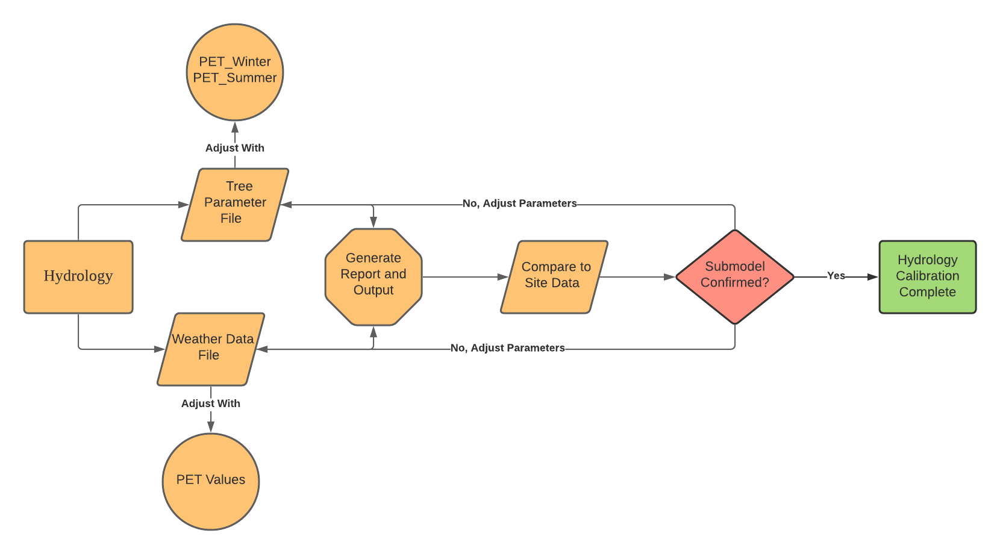
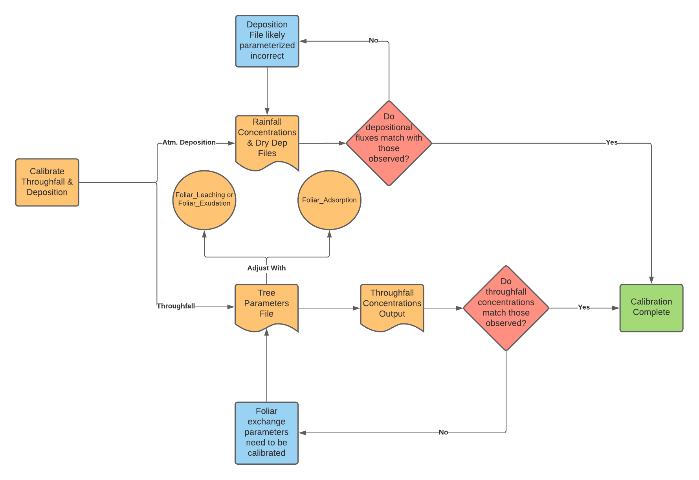
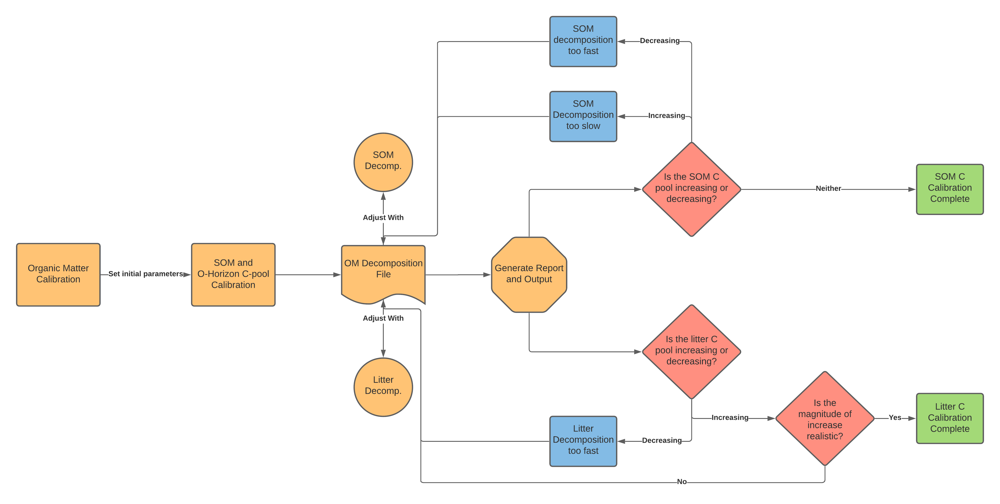
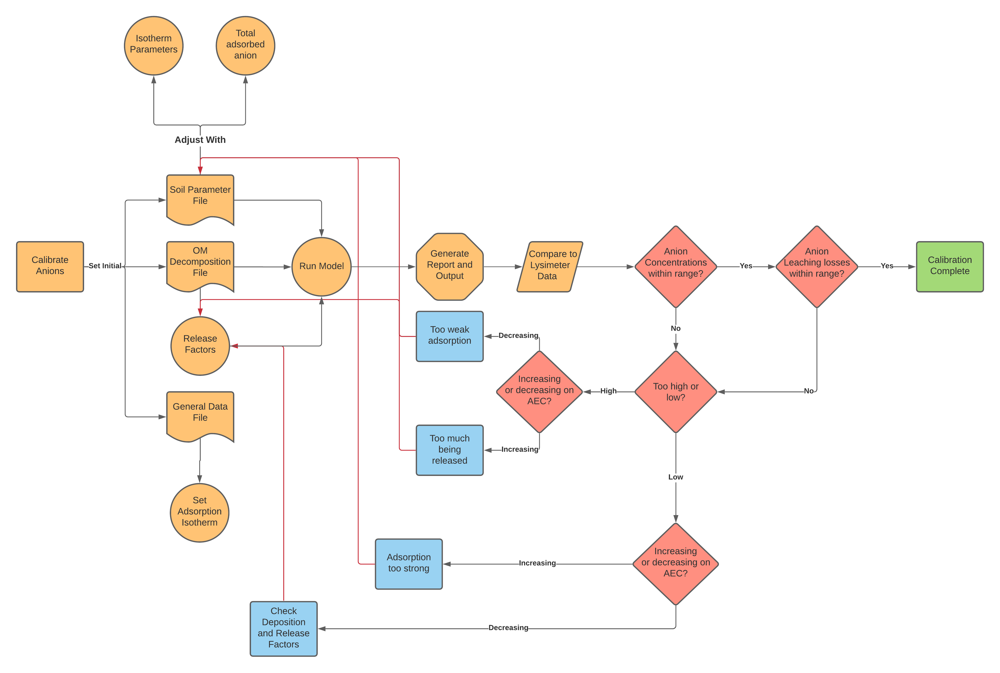
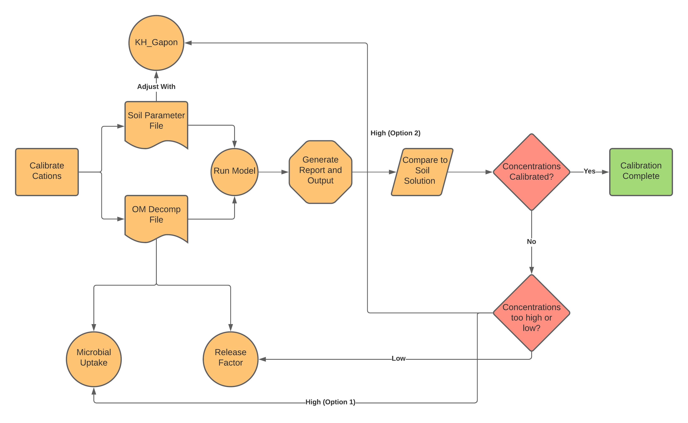

## Project Progress

Recent progress on my project has been centered around the calibration of NutsFor towards the 4 base case
sites I'm representing in my work.  I first started by exploring the model, shifting its parameters and
observing outputs. I did this by writing a R program that reads NutsFor data files and visualizes them after
each model run. Once I understood how the model's parameters functioned together, I calibrated the model by
individually calibrating each sub-module within the larger model. The order of calibration was choosen based on the 
hiearchal relationship between the model's sub-systems proposed for the Nutrient Cycling Model [].
For instance, hydrology will have the most 
control over model outputs, and should therefore be calibrated first. Deposition and throughfall fluxes will
determine nutrient fluxes in the organic layers, and is calibrated second. Organic matter decomposition
and buildup will control cation and anion nutrient release rates, and is calibrated third. 
Anion concentrations can push cations off of the CEC and into solution, they thus control cation
concentrations and should be calibrated forth. Cation concentrations are dependent on all previous 4 systems, and
are calibrated last. I additionally added the N-Cycle calibration proccess at the 

1). Hydrology

I used evaporation data for the Oregon Coast region[@safleyPart651Appendix2009], and drainage data from
[@perakisBiogeochemistryTemperateForest2011] to calibrate evapotranspiration and water leaching fluxes
in my simulated sites. I assumed the same hydrological outputs between the basalt and sedimentary sites.
I also assumed that hydrology was constant over time, 

2). Through fall and Deposition

Little was known about throughfall concentrations within the range of interest. Nearby throughfall data
was confounded by site rain chemistry differences [@sollinsInternalElementCycles1980]. I instead made no
assumptions about throughfall concentrations, except for $K^+$, which is generally known to leach in high
concentrations from leaf and needle surfaces [@sollinsInternalElementCycles1980; @tukeyLeachingSubstancesPlants1970].

Similar to throughfall concentrations, little was known about Dry deposition of nutrient elements, I thus made no
assumptions about the input of nutrients from dry deposition.

|Wet deposition data was taken from the National Atmospheric Deposition Progam's wet deposition data taken for
the ALSEA OR02 site [@NationalAtmosphericDeposition2020a]. Rainfall concentrations for the years of 2005-2006 were
used for the calibration of the model, and repeated over the length of the simulation for predictive simulations.
This was necessary as NADP monitoring for the ALSEA site stopped in 2007. 

3). Soil Organic Matter

Litter C pool and SOM C pool content was calibrated using decomposition parameters in the model. The litter 
C pool was allowed to build up over time following data from
[@coleComparisonCarbonAccumulation1995; @tarrantAccumulationOrganicMatter1963;
and 
@klopatekLitterDecompositionContrasts2008]. 
The SOM C pool was kept stable over the initial short term calibration, the idea is to keep 
SOM C stable over the entire simulation time period (~500 years). 

Once the SOM C and Litter C buildup matched observed trends and roughly aligned with
the known magnitude of C buildup, parameters were accepted. 

4). Anion Calibration

Parameters controlling anion concentrations were calibrated until soil solution concentrations
of anions matched those observed in lysimeter data. This was done for sulfate, phosphate, and chloride,
organic acids ($R^-$) were not measured, the concentrations of $R^-$ were separately calibrated to balance 
ANC and pH. As a point of additional constraint, leaching fluxes of anions were observed at the
20cm and 100cm layers to ensure simulated S-losses did not exceed or go below those observed in nature. 

5). Cation calibration

Cation Calibration

6). Final Calibration (10-year observation)

7). Alternative Calibration: Basalt Sites

## Learning Outcomes Progress

## References

