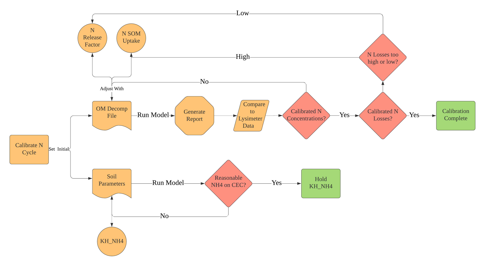

Recent progress on my project has been centered around the calibration of NutsFor towards the 4 base case
sites I'm representing in my work.  I first started by exploring the model, shifting its parameters and
observing outputs. I did this by writing a R program that reads NutsFor data files and visualizes them after
each model run. Once I understood how the model's parameters functioned together, I calibrated the model by
individually calibrating each sub-module within the larger model. The order of calibration was:

1). Hydrology

I used evaporation data for the Oregon Coast region[@safleyPart651Appendix2009], and drainage data from
[@perakisBiogeochemistryTemperateForest2011] to calibrate evapotranspiration and water leaching fluxes
in my simulated sites. I assumed the same hydrological outputs between the basalt and sedimentary sites.
I also assumed that hydrology was constant over time, 

2). Through fall and Deposition

3). Soil Organic Matter

4). Anion Calibration

5). Cation calibration

6). Final Calibration (10-year observation)

#References

